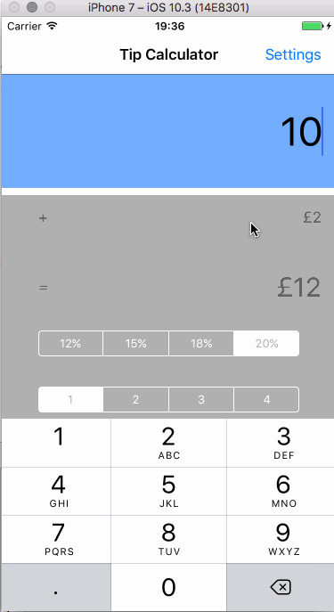
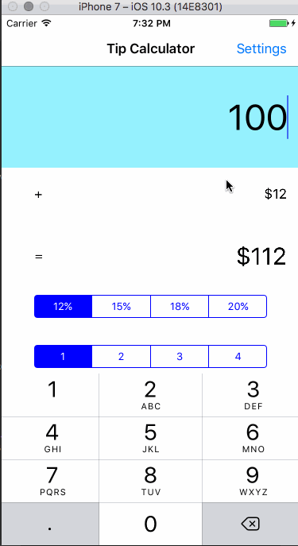
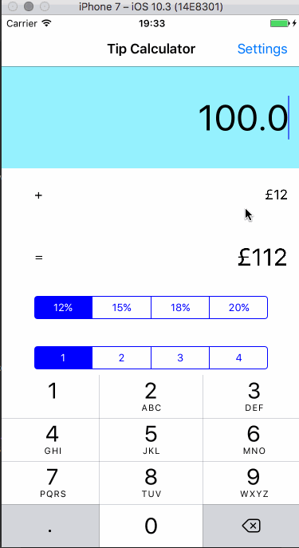

# Pre-work - yatic
yatic is a tip calculator application for iOS.

Submitted by: Phuong Nguyen

Time spent: 8 hrs

## User Stories

The following **required** functionality is complete:

* [x] User can enter a bill amount, choose a tip percentage, and see the tip and total values.
* [x] Settings page to change the default tip percentage.

The following **optional** features are implemented:
* [x] UI animations
* [x] Remembering the bill amount across app restarts (if <10mins)
* [x] Using locale-specific currency and currency thousands separators.
* [x] Making sure the keyboard is always visible and the bill amount is always the first responder. This way the user doesn't have to tap anywhere to use this app. Just launch the app and start typing.

The following **additional** features are implemented:

* [x] Split bills
* [x] Remember selected tip percentage
* [x] Dark and light themes
* [x] Firebase Analytics

Here's a walkthrough of implemented user stories:

**General functionalities:**

**Local switching:**

**Theme switching:**

GIF created with [LiceCap](http://www.cockos.com/licecap/).

**Question 1**: "What are your reactions to the iOS app development platform so far? How would you describe outlets and actions to another developer? Bonus: any idea how they are being implemented under the hood? (It might give you some ideas if you right-click on the Storyboard and click Open As->Source Code")

Coming from Android development, Xcode provides a much better WYSIWYG environment than Studio. There is a lot less boiler plate codes which make less overwhelming for new coder. Interface builder generates xml that describe layout, behavior and even build instructions. I'm not sure I like having aspects that are generally independent of each other being rolled into one single XML. This make it a lot harder to track changes to indivudal aspect in source control. As in, to be able to figure out quickly which changeset was pixel pushing vs behavioral. The generated sources are fairly easy to read. I was surprised how much Swift language has changed/evolved (when code copy-pasted from stackoverflow did not work) and even more pleasantly surprised to see Xcode guiding me through the updates.

Question 2: "Swift uses [Automatic Reference Counting](https://developer.apple.com/library/content/documentation/Swift/Conceptual/Swift_Programming_Language/AutomaticReferenceCounting.html#//apple_ref/doc/uid/TP40014097-CH20-ID49) (ARC), which is not a garbage collector, to manage memory. Can you explain how you can get a strong reference cycle for closures? (There's a section explaining this concept in the link, how would you summarize as simply as possible?)"

When a closure is assigned to a class property, that creates a strong reference from the class instance to the closure. If the clossure also references class property, it would capture class instance, creating a strong reference to the class, hence a strong reference cycle. 

This question actually made me to back and re-read the differences between GC and ARC. I wonder how much ARC play into iOS's more predictable performance comparing to Android. Being so  used to GC where circular references are not a concern, this will take some getting used to.

## License

    Copyright [2017] [Phuong Nguyen]

    Licensed under the Apache License, Version 2.0 (the "License");
    you may not use this file except in compliance with the License.
    You may obtain a copy of the License at

        http://www.apache.org/licenses/LICENSE-2.0

    Unless required by applicable law or agreed to in writing, software
    distributed under the License is distributed on an "AS IS" BASIS,
    WITHOUT WARRANTIES OR CONDITIONS OF ANY KIND, either express or implied.
    See the License for the specific language governing permissions and
    limitations under the License.
